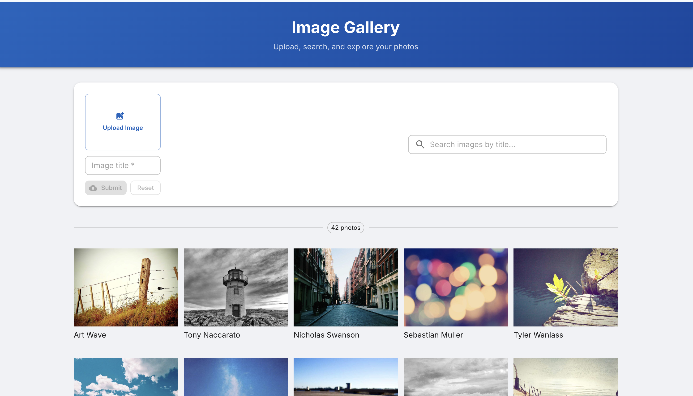

# Image Gallery

A full-stack photo gallery web app — upload, search, browse, and delete photos with a clean, responsive UI.

**Live Demo:** https://image-gallery-client-alpha.vercel.app



Built with **React 18**, **Node.js/Express**, and **MongoDB**.

---

## Features

- **Upload Photos** — Direct browser-to-cloud upload via Cloudinary (no backend round-trip)
- **Instant Preview** — Preview image before saving to keep your gallery clean
- **Real-time Search** — Debounced search across image titles with MongoDB regex matching
- **Delete Photos** — Hover any photo to reveal a delete button
- **Responsive Grid** — Adapts from 2 columns on mobile to 6 on large displays
- **Lazy Loading** — Images load on demand for a fast initial page load

---

## Tech Stack

| Layer | Technology |
|-------|------------|
| Frontend | React 18, Material UI v5, Vite |
| File Upload | Cloudinary (unsigned upload) |
| Backend | Node.js, Express 5 |
| Database | MongoDB, Mongoose |
| Deployment | Vercel (client + server) |

---

## Getting Started

### Prerequisites

- Node.js 18+
- MongoDB running locally or a [MongoDB Atlas](https://www.mongodb.com/atlas) URI
- A free [Cloudinary](https://cloudinary.com) account with an **unsigned upload preset**

### Installation

```bash
git clone https://github.com/<your-username>/Image-Gallery-fullstack.git
cd Image-Gallery-fullstack

# Install server dependencies
cd Server && npm install

# Install client dependencies
cd ../Client && npm install
```

### Environment Variables

**`Server/.env`**
```
MONGODB_URL=mongodb://localhost:27017/imageGallery
CLIENT_URL=http://localhost:5173
PORT=5001
```

**`Client/.env`**
```
VITE_CLOUDINARY_CLOUD_NAME=your_cloud_name
VITE_CLOUDINARY_UPLOAD_PRESET=your_unsigned_upload_preset
VITE_GET_IMAGES=http://localhost:5001/images
VITE_POST_IMAGE_URL=http://localhost:5001
```

### Run Locally

```bash
# Terminal 1 — API server
cd Server && npm start

# Terminal 2 — React dev server
cd Client && npm start
```

App: `http://localhost:5173`  
API: `http://localhost:5001`

---

## API Reference

| Method | Endpoint | Description |
|--------|----------|-------------|
| `GET` | `/images` | Fetch all images. Supports `?search=query` |
| `POST` | `/` | Save image `{ imageText: string, imageUrl: string }` |
| `DELETE` | `/images/:id` | Delete image by MongoDB ID |

---

## Project Structure

```
Image-Gallery-fullstack/
├── Client/                        # React frontend (Vite)
│   └── src/
│       ├── components/
│       │   ├── ImageGallery.jsx   # Upload form + search toolbar
│       │   └── Images.jsx         # Responsive photo grid
│       ├── theme.js               # MUI custom theme
│       └── styles.js              # Shared component styles
└── Server/                        # Express REST API
    ├── server.js                  # Routes & middleware
    ├── models.js                  # Mongoose Image schema
    └── DBConnection.js            # MongoDB connection
```

---

## License

MIT
